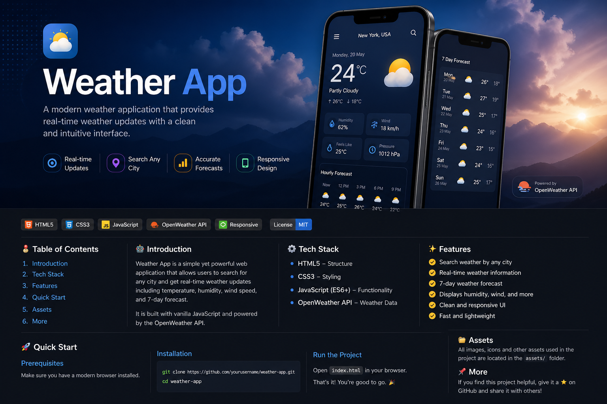
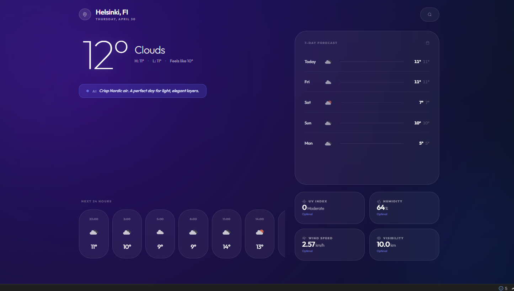

# 🌦️ Weather App (Android)



> A modern Android weather application that provides real-time weather updates with a clean and intuitive UI.

---

## 🚀 Features

* 🌍 Search any city
* 🌡️ Real-time weather updates
* 📅 7-day forecast
* 📱 Modern Android UI
* ⚡ Fast & smooth performance

---

## ⚙️ Tech Stack

* 🧩 Kotlin / Java
* 🏗️ Android Studio
* 🌐 REST API (OpenWeather)
* 🎨 XML UI

---

## 📸 Weather Apps



---

## 🚀 Getting Started

### Prerequisites

* Android Studio installed
* Internet connection

### Installation

```bash
git clone https://github.com/yourusername/weather-app-android.git
```

Open project in Android Studio → Click Run ▶️

---

## 📂 Project Structure

```
app/
 ├── src/main/java/
 ├── res/layout/
 ├── AndroidManifest.xml
```

---

## 📌 Author

Shriyash Zoman
